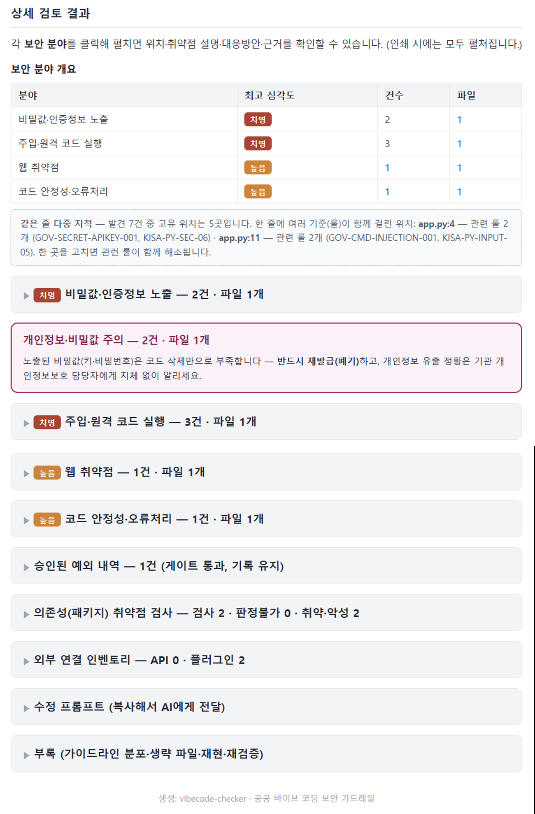

<div align="center">

<!-- 로고: docs/assets/logo.png 를 추가하면 아래 줄의 주석을 해제하세요 -->
<!--  -->

# vibecode-checker

### AI로 빠르게 만든 코드, 한국 정부 보안 기준으로 점검하세요.

바이브 코딩(AI 코딩 도구로 빠르게 개발)한 결과물에 숨은 **개인정보 노출·API 키·SQL 삽입·위험한 명령 실행·취약 패키지**를, 공무원이 이해할 수 있는 **한국어 리포트**로 알려주는 보안 점검 도구입니다.


</div>

---

## 데모

**쓰는 법은 아주 간단합니다 — 둘 중 편한 쪽으로:**

- **AI 코딩 도구**(VS Code·Claude Desktop·Cursor)에 연결했다면, 코드를 짠 자리에서 **그냥 말하면 됩니다**:
  *"이 폴더 보안 검사 해줘"* · *"이 코드 안전한지 확인해줘"* · *"보안 점검 리포트 써줘"*
- **터미널**이 익숙하면 명령 한 줄: `gvskb scan ./내프로젝트`

어느 쪽이든 **무엇이 위험한지 → 왜 위험한지 → 어떻게 고치는지(안전한 코드 예시)** 까지 한국어 보고서로 돌려줍니다.

**아래는 실제로 생성되는 HTML 보고서 화면입니다.** 검사 결과를 파일로 저장하면 텍스트(`.md`)와 함께 이 HTML 보고서가 자동으로 만들어지고, 인쇄하면 그대로 PDF 결재 문서로 쓸 수 있습니다.

<p align="center">
  
  <br/><sub><b>① 요약층 (공무원)</b> — 배포 승인/미승인 결론 박스 → 핵심 숫자 → 조치 가이드(3단계)</sub>
</p>

<p align="center">
  
  <br/><sub><b>② 상세층 (보안팀)</b> — 보안 분야별로 묶어 접힘, 펼치면 위치·취약점·대응·근거. 개인정보·의존성·승인 예외도 함께</sub>
</p>

<!-- 터미널 데모 GIF를 추가하려면 docs/assets/demo.gif 녹화 후 아래 주석을 해제하세요 -->
<!--  -->

보고서는 **두 독자**를 위해 두 층으로 구성됩니다.

- **① 요약층 — 비전문 공무원용 (항상 펼침, 두괄식)**: 문서 헤더(대상·검사일시) → **결론 박스(배포 _승인 가능_ = 초록 / _미승인_ = 빨강)** → 핵심 숫자 → *조치 가이드 3단계* → 가장 먼저 할 일 → 검토 범위·한계.
- **② 상세층 — 보안담당자용 (기본 접힘)**: 발견을 **보안 분야별**(개인정보·비밀값·주입·웹·암호화·설정 오류·AI 위험·코드 안정성)로 묶어, 분야를 펼치면 *위치 · 왜 위험한지 · 대응 방법 · 근거(출처)* 가 나옵니다. **의존성(패키지) 취약점**·**외부 데이터 전송 인벤토리**·**수정 프롬프트(복사 버튼)** 도 함께 들어갑니다.

상세는 모두 기본 접혀 있어 한눈에 들어오고, **인쇄(→PDF) 시 자동으로 펼쳐집니다.** 그대로 공문 '붙임'으로 제출하면 보안팀이 이 문서로 보안성 검토를 진행할 수 있습니다.

**보고서 내용은 이렇게 생겼습니다** (텍스트 버전 요약):

```text
── 요약층 (공무원) ─────────────────────────────
## 결론
> ### 배포 미승인 (차단)              ← 빨강 박스(승인이면 초록)
> 배포 판정 · 배포 불가 — 차단 6건을 해소하거나 보안담당자 승인이 필요합니다.

## 요약
- 발견된 위험 7건 · 차단 6건 · 최고 심각도: 치명
- 취약 패키지 2건 · 승인된 예외 1건 (요약에서 제외)

## 조치 가이드 — 3단계만 따라 하세요
  1) 고치기 → AI 도구에 "…위험들을 안전하게 고쳐줘"
  2) 확인하기  3) 다시 검사

── 상세층 (보안팀, 분야별·클릭해 펼침) ──────────
## 상세 검토 결과
### 비밀값·인증정보 노출 — 치명 · 2건
  [치명·차단] API 키/비밀번호가 코드에 포함됨 — app.py 9번째 줄
    왜 위험한가 : 키가 저장소·로그·LLM 프롬프트로 새면 계정·시스템이 탈취됩니다
    대응 방법   : 환경변수·기관 secret manager로 옮기고, 노출된 키는 반드시 재발급(폐기)
    근거(출처)  : NIST SSDF, OWASP ASVS V6
```

---

## 목차

- [60초 시작 가이드](#60초-시작-가이드)
- [누구에게 필요한가](#누구에게-필요한가)
- [무엇을 잡아주나요](#무엇을-잡아주나요)
- [사용 가이드 (초보 → 고급)](#사용-가이드)
- [무엇을 탐지하나 — 룰과 출처](#무엇을-탐지하나--룰과-출처)
- [성능 (정직하게)](#성능-정직하게)
- [공공기관 · 망분리 환경](#공공기관--망분리-환경)
- [기여하기](#기여하기)
- [연락 · 문의](#연락--문의)
- [면책 · 라이선스](#면책--라이선스)

---

## 안내 자료 (다운로드해서 그대로 열람·배포)

기관 내 설명·교육·보안성 검토에 쓸 수 있는 **자체완결형 HTML 문서**입니다
(외부 로딩 없음 — 망분리 PC에서도 브라우저로 바로 열립니다).

| 자료 | 대상 | 내용 |
|---|---|---|
| [안내자료 (공무원용)](docs/안내자료_공무원용.html) | 사용 부서 공무원 | 효과·사용법·작동 체계도·결과 대응 요령 (발표 슬라이드형) |
| [기술 설명서 (전문가용)](docs/기술설명_전문가용.html) | 보안팀·개발자 | 아키텍처·탐지 엔진·룰 체계·검증·한계 (11개 장) |
| [인텔 운영·활용 구조](docs/인텔_운영활용구조.html) | 보안팀·운영 담당 | 일일 자동 갱신 파이프라인, 망분리 반입 절차, 7겹 검증 장치 |
| [향후 운영 계획](docs/운영계획.html) | 유지관리자·보안팀 | 최신성·점검 품질 유지 — 주기별 캘린더, R&R, 품질 원칙, 체크리스트 |

---

## 60초 시작 가이드

### 전제 조건 (Prerequisites)

- **Python 3.11 이상** (`python --version`으로 확인)
- 운영체제 무관 (Windows·macOS·Linux). Windows 한글 깨짐은 [한 번만 설정](docs/windows_utf8.md)

### 설치 (Installation)

먼저 패키지를 설치합니다. **CLI든 AI 코딩 도구(MCP)든 이 설치 하나면 둘 다 됩니다** — `gvskb` 명령과 MCP 서버(`python -m gvskb.server`)가 함께 설치됩니다.

> 현재 **PyPI에는 배포하지 않습니다**(공공기관·망분리 환경의 공급망 보안 고려). **GitHub 소스에서 설치**합니다.

```bash
# 가장 간단 — 한 줄 설치 (Python 3.11+)
pip install git+https://github.com/Lex6won/vibecode-checker.git

# 또는 소스를 받아 설치 (수정·기여하려면 -e 권장)
git clone https://github.com/Lex6won/vibecode-checker.git
cd vibecode-checker && pip install -e .
```

설치를 확인합니다:

```bash
gvskb doctor      # 룰 수·인코딩·MCP 상태 점검
```

> 망분리(인터넷 없는) PC라면, 외부망에서 위 소스를 받아(또는 `pip download`로 의존성까지) 옮긴 뒤 오프라인 설치하세요.

#### AI 코딩 도구에 MCP 연결 (선택)

AI 코딩 도구에서 **자연어로** 쓰려면 MCP 설정에 서버를 등록합니다(위 `pip install` 이후). 아래는 **Claude Desktop·Cursor·Claude Code 공통 형식**입니다(최상위 키 `mcpServers`). VS Code는 형식이 달라 표 아래에 따로 안내합니다.

```json
{
  "mcpServers": {
    "vibecode-checker": {
      "command": "python",
      "args": ["-m", "gvskb.server"],
      "env": { "PYTHONUTF8": "1", "PYTHONIOENCODING": "utf-8" }
    }
  }
}
```

설정 파일 위치(도구별):

| 도구 | 설정 파일 |
|---|---|
| **Claude Desktop** | Windows `%APPDATA%\Claude\claude_desktop_config.json` · macOS `~/Library/Application Support/Claude/claude_desktop_config.json` |
| **Cursor** | 프로젝트 `.cursor/mcp.json` 또는 전역 `~/.cursor/mcp.json` (설정 → MCP) — 키 `mcpServers` |
| **VS Code** (Copilot Agent) | 워크스페이스 `.vscode/mcp.json` — 키가 `servers`(≠`mcpServers`)이고 `"type": "stdio"` 필요. 표 아래 스니펫 참고 |
| **Claude Code (CLI)** | 프로젝트 루트 `.mcp.json` (키 `mcpServers`, 이 저장소의 [`.mcp.json`](.mcp.json) 참고) · 또는 `claude mcp add` 명령 |

**VS Code 전용** — `.vscode/mcp.json` 은 키가 `servers` 이고 `type` 이 필요합니다(위 `mcpServers` 형식과 다름):

```json
{
  "servers": {
    "vibecode-checker": {
      "type": "stdio",
      "command": "python",
      "args": ["-m", "gvskb.server"],
      "env": { "PYTHONUTF8": "1", "PYTHONIOENCODING": "utf-8" }
    }
  }
}
```

저장 후 도구를 재시작하면 연결됩니다. 확인: AI에게 *"server_status로 룰이 몇 개 로드됐는지 확인해줘"*.
(`python` 이 PATH에 없으면 전체 경로로 바꾸세요. Windows 한글 깨짐은 [한 번만 설정](docs/windows_utf8.md).)

> **신뢰하는 환경에서만 연결하세요** — MCP는 지정한 경로의 로컬 파일을 읽습니다([SECURITY.md](SECURITY.md)).

### 사용 (Usage)

쓰는 방식은 두 가지입니다. **터미널이 익숙하면 A**, **AI 코딩 도구를 쓰면 B** — 둘 중 편한 쪽으로.

#### A. 명령어(CLI)로 — 터미널에서

```bash
gvskb doctor                                  # 1) 내 환경 점검(룰 수·인코딩·MCP·인텔 캐시)
gvskb scan ./my-project                        # 2) 내 폴더 검사 → 화면에 한국어 리포트
gvskb scan ./my-project -o 보안점검.md          # 3) 결과를 파일로 저장(-o=output) → .md + .html 함께
gvskb scan ./my-project --check-deps -o 보안점검.md   # 4) 취약·악성 패키지 검사까지 리포트에 병합

# 5) GitHub 레포는 받아서 검사 (URL → 폴더로 받은 뒤 동일하게 점검)
git clone --depth 1 https://github.com/owner/repo /tmp/repo && gvskb scan /tmp/repo -o 보안점검.md
```

> `--check-deps`는 requirements.txt·package.json의 패키지를 취약점 DB로 검사해 **코드+패키지 위험을 보고서 한 장**에 담습니다(전송되는 것은 패키지명·버전뿐). 망분리에서는 반입한 인텔 캐시 기준으로 판정하며, **판정 불가는 '안전'이 아니라고 표시**됩니다.

여기서 `-o`는 **output(출력 파일)** 옵션입니다 — `-o 파일이름`을 붙이면 결과를 화면 대신 그 이름의 파일로 저장합니다. 마크다운/HTML 형식이면 텍스트 `파일이름.md`와 인쇄→PDF 결재용 `파일이름.html`이 **함께** 만들어집니다. (`-o`를 빼면 결과가 화면에만 출력됩니다.)

#### B. AI 코딩 도구에서 — 그냥 말로 (VS Code·Claude Desktop·Cursor)

[MCP를 한 번 연결](#더-써보기--mcp의존성오프라인)한 뒤, 코드를 짠 자리에서 **자연어로** 요청하면 됩니다. 명령어를 외울 필요가 없습니다:

- *"이 폴더 **보안 검사 해줘** → ./my-project"*
- *"이 코드가 **안전한지 확인해줘**"* (코드를 붙여넣고)
- *"**보안 체크 리포트 써줘**"* / *"**HTML 보고서로** 만들어줘"*
- *"이 깃허브 레포 **보안 점검**해줘 → https://github.com/owner/repo"*
- *"고쳤어, **다시 검사**해줘"*

트리거 단어: **보안 · 점검 · 체크 · 검토 · 검사 · 스캔 · "안전한지"**. Claude·Cursor에서는 `/보안점검` 명령으로도 한 번에 실행됩니다.

> **로컬 폴더·붙여넣은 코드**는 세 도구 모두 동작합니다. **GitHub URL을 직접 주는 것**은 셸을 쓰는 도구(**Claude Code·Cursor**)에서 됩니다 — AI가 먼저 `git clone` 후 검사합니다. **Claude Desktop**처럼 셸이 없으면 폴더를 가리키거나 코드를 붙여넣으세요(또는 먼저 clone).

> 비전공자용 한 장 요약: [30초 시작 가이드](docs/quickstart_ko.md)

---

## 누구에게 필요한가

- **"AI한테 시켜서 만든 코드, 이거 그냥 써도 되나요?"** — **ChatGPT · Claude · Gemini · GitHub Copilot · Cursor** 같은 AI 도구로 업무용 코드를 만드는 분
- **민원 처리·통계·DB 조회·파일 업로드·챗봇** 같은 걸 AI로 빠르게 만들어 보는 공공기관 실무자
- **외주(위탁) 개발로 받은 코드를 실제로 쓰기 전에 한 번 더 점검**하고 싶은 담당자
- **보안은 잘 모르지만** "이게 위험한 코드인지, 위험하면 어떻게 고치는지" 쉬운 말로 알고 싶은 분

---

## 무엇을 잡아주나요

| 흔한 실수 | 예시 |
|---|---|
| 코드에 박힌 비밀값 | `DB_PASSWORD = "admin1234"`, API 키, JWT 토큰 |
| 개인정보 노출 | 주민등록번호·전화번호 평문 저장 |
| SQL 삽입 | `"SELECT … WHERE name='" + name + "'"` |
| 위험한 코드 실행 | `eval()`, `exec()`, `os.system(사용자입력)` |
| 웹 취약점 | XSS, 경로 조작, Flask `debug=True` 배포 |
| 취약·가짜 패키지 | 알려진 CVE, 오타 노린 typosquat(`reqeusts`) |
| AI 특화 위험 | **프롬프트 인젝션**(신뢰 못할 입력이 LLM 프롬프트에 결합), 프롬프트에 개인정보 전송, LLM 출력 무검증 실행 |
| 외부 데이터 전송 | 외부 AI API·플러그인이 **어디로(국외 포함) 무슨 데이터**를 보내는지 인벤토리로 정리(검토용) |
| 폐쇄망(망분리) 영향 | **CDN 스크립트·웹폰트 등 외부 리소스 로딩**과 외부 API 호출을 표시 — 폐쇄망에서 화면·기능이 깨지거나 정책 위반 전송이 될 지점을 배포 전에 확인 |


> **외부 연결 인벤토리** — 외부 AI API와 설치된 플러그인이 *어디로(국외 포함) 무슨 데이터*를 보내는지 리포트에 **목록**으로 보여줍니다. **사용 금지가 아니라 검토용**입니다 — 개인정보가 함께 나갈 수 있는 지점·국외 전송을 보안팀이 먼저 확인하도록 돕습니다(모델명·버전·이용 정보 포함). AI API 사용 자체는 위험으로 취급하지 않습니다.

---

## 사용 가이드

### 처음이신가요 — 검사하고 리포트 읽기

```bash
gvskb scan ./my-project                              # 화면 출력
gvskb scan ./my-project --format markdown -o 보고서.md # 파일 저장
```

리포트 맨 위 **결론 박스의 색**만 봐도 배포해도 되는지 바로 알 수 있습니다:

| 결론 박스 | 뜻 | 무엇을 하나요 |
|---|---|---|
| **배포 승인 가능** | 심각한 위험 미발견 | 단, '검토 범위·한계'는 확인 |
| **배포 미승인 (차단)** | 그대로 배포하면 위험 | 먼저 고치거나 보안담당자 승인 |
| **배포 보류 (확인 필요)** | 주의 항목 있음 | 확인·수정 후 배포 |

각 발견의 심각도는 `치명 → 높음 → 보통`, 판정은 `차단(block) → 경고(warn) → 허용(allow)`로 표시됩니다.

> **검사된 파일이 0개**라고 나오면 "안전"이 아니라 *경로·확장자를 확인*하라는 뜻입니다(결론은 '판정 불가').

### 더 써보기 — MCP·의존성·오프라인

<details>
<summary><b>GitHub 레포를 통째로 검사하기</b></summary>

이 도구는 **로컬 코드**를 검사합니다. 레포는 먼저 받은 뒤 그 폴더를 가리키면 됩니다
(코드를 외부로 보내지 않고, 받은 코드를 실행하지도 않습니다 — 정적으로 읽기만).

```bash
git clone --depth 1 https://github.com/owner/repo /tmp/repo
gvskb scan /tmp/repo -o 보안점검.md          # .md + .html 생성
# git 없이: curl -L .../archive/refs/heads/main.tar.gz | tar xz && gvskb scan repo-main
```

- **AI 도구에 연결했다면** URL만 줘도 됩니다: *"이 깃허브 레포 보안 점검해줘 → URL"* → AI가 먼저 `git clone` 후 검사합니다.
- **CI 자동화**: PR·푸시마다 검사하려면 [GitHub Actions 예시](#ci에-넣고-싶다면--자동-게이트)를 쓰세요(`checkout` → `gvskb scan`).
- **망분리 환경**에서는 clone이 안 되므로, 외부망에서 받은 폴더/zip을 반입해 로컬 경로로 검사하세요(`GVSKB_MODE=offline` 은 원격 URL을 받지 않음).

> 정리하면 — **폴더를 가리키거나 GitHub URL을 주고 "보안 점검"** 하면 됩니다. URL은 "받아서 폴더 검사"로 이어질 뿐 본질은 같습니다.
</details>

<details>
<summary><b>AI 코딩 도구(Claude Code·Cursor)에 연결하기</b></summary>

`claude_desktop_config.json` 등에 추가하면, AI에게 자연어로 "이 코드 안전한지 검사해줘"라고 물을 수 있습니다.

```json
{
  "mcpServers": {
    "vibecode-checker": {
      "command": "python",
      "args": ["-m", "gvskb.server"],
      "env": { "PYTHONUTF8": "1", "PYTHONIOENCODING": "utf-8" }
    }
  }
}
```
연결 후: *"server_status로 룰이 몇 개 로드됐는지 확인해줘"*

**이렇게 말하면 됩니다** (도구 이름을 몰라도, 아래 단어가 들어가면 점검→보고서까지 진행됩니다):

- *"이 폴더 **보안 점검**해줘 → ./my-project"*
- *"방금 만든 이 코드 **안전한지 체크**해줘"*
- *"이 파일 **검토**하고 위험한 부분을 한국어 보고서로 만들어줘"*
- *"고쳤어, **다시 검사**해줘"*

트리거 단어: **보안 · 점검 · 체크 · 검토 · 검사 · 스캔 · "안전한지"**. Claude·Cursor에서는 `/보안점검` 명령으로도 한 번에 실행됩니다. 잘 안 불러오면 *"vibecode-checker로 점검해줘"* 라고 덧붙이세요.

> **신뢰하는 클라이언트에만 연결하세요.** MCP `scan_path` 도구는 지정한 경로의 **로컬 파일을 읽습니다**(검사 목적). 연결한 AI 클라이언트가 임의 경로를 스캔하도록 요청할 수 있으므로, 신뢰할 수 있는 클라이언트·환경에서만 사용하고 민감 디렉터리는 가리키지 마세요. 자세한 내용은 [SECURITY.md](SECURITY.md) 참고.
</details>

<details>
<summary><b>설치하려는 패키지가 안전한지 확인하기</b></summary>

```bash
gvskb check-package requests --ecosystem pypi    # 알려진 취약점 조회
gvskb check-package reqeusts --ecosystem pypi    # 오타 패키지(typosquat) 경고
```
</details>

<details>
<summary><b>인터넷 없는 망분리 환경에서 쓰기</b></summary>

**방법 A — 매일 자동 생성되는 공식 번들 내려받기 (권장, 가장 쉬움)**

GitHub Actions가 **매일 03:00(KST)** 최신 위협 인텔(OSV 악성 피드·CISA KEV·NVD·EPSS)을
수집해 검증 가능한 반입 번들을 고정 URL로 게시합니다:

```bash
# (외부망 PC) 매일 갱신되는 번들 + sha256 을 내려받아 해시를 확인합니다
#   https://github.com/Lex6won/vibecode-checker/releases/tag/intel-latest
curl -LO https://github.com/Lex6won/vibecode-checker/releases/download/intel-latest/gvskb-intel-bundle.zip
curl -LO https://github.com/Lex6won/vibecode-checker/releases/download/intel-latest/gvskb-intel-bundle.zip.sha256
sha256sum -c gvskb-intel-bundle.zip.sha256      # OK 확인 후 USB로 이동
```

**방법 B — 직접 수집해 번들 만들기**

```bash
# (외부망 PC) 보안 피드 캐시를 받아 검증 가능한 반입 번들로 만듭니다
gvskb update-intel --all                       # npm 패키지도 쓰면: GVSKB_OSV_INCLUDE_NPM=1
gvskb intel-bundle export gvskb-intel-bundle.zip   # 캐시 + sha256 manifest 를 zip 하나로
```

**반입·사용 (A·B 공통)**

```bash
# (매체 반입) gvskb-intel-bundle.zip 을 USB로 옮깁니다

# (망분리 PC) 무결성 전수 검증 후 반입하고, 외부 호출 없이 로컬 룰·캐시로만 검사
#   캐시 위치: %USERPROFILE%\.gvskb\cache  (환경변수 GVSKB_CACHE_DIR로 변경 가능)
gvskb intel-bundle import gvskb-intel-bundle.zip   # sha256 불일치면 전체 거부
$env:GVSKB_MODE = "offline"      # PowerShell
gvskb doctor --offline           # 인텔 캐시 존재·신선도까지 점검됩니다
gvskb scan ./my-project --check-deps
```
정적 분석 룰은 **외부 통신 없이 그대로 동작**합니다. 반입한 캐시는 로드 시
**sha256 무결성을 재검증**하고(변조·손상 시 자동 무시), 기본 **30일**
(`GVSKB_INTEL_MAX_AGE_DAYS`로 조정)이 지나면 '이상 없음'을 **판정 보류로 승격**해
오래된 캐시가 최신처럼 보이지 않게 합니다. 오프라인 검사 리포트에는 **어느 날짜
캐시 기준의 판정인지**(피드별 기준일)가 자동 표기되고, KEV 등재 취약점에는
**EPSS 악용확률·CVSS 점수**가 병기되어 보안팀이 우선순위를 바로 정할 수 있습니다.

> **점검 이력(감사로그)** — `GVSKB_AUDIT_DIR` 환경변수를 설정하면 스캔·차단·예외
> 승인·인텔 갱신 이력이 월별 JSONL로 append 기록됩니다. 원본 코드·개인정보는 저장하지
> 않고 해시와 마스킹된 증거만 남깁니다(기관 감사 증빙용, 기본 비활성).

<details>
<summary><b>오탐·수용 위험을 '승인된 예외'로 관리하기</b></summary>

스캔 루트에 `.gvskb-exceptions.yaml` 을 두면, 오탐이거나 기관이 위험을 수용하기로
결정한 발견을 **숨기지 않고 기록하며** 게이트(exit code·배포 판정)만 통과시킵니다.

```yaml
exceptions:
  - rule_id: GOV-FLASK-DEBUG-001
    file: app.py
    line: 47                 # 선택 — 지정하면 그 줄만
    reason: 내부 개발서버 전용 — 외부 노출 없음
    approved_by: 김보안(정보보안담당관)
    expires: 2026-12-31      # 만료되면 자동으로 다시 차단됩니다
```

`reason`·`approved_by`·`expires`가 **모두 있어야** 유효합니다. 억제된 발견은
리포트의 '승인된 예외 내역'과 감사로그(`approve_bypass`)에 남습니다.
</details>

<details>
<summary><b>CI·보안도구 연동 (SARIF)</b></summary>

```bash
gvskb scan ./src --format sarif -o result.sarif   # SARIF 2.1.0
```

GitHub code scanning 에 업로드하거나 기관 보안도구로 수집할 수 있습니다.
</details>
</details>

### CI에 넣고 싶다면 — 자동 게이트

`gvskb scan`은 결과에 따라 **종료 코드(exit code)**를 반환해 커밋·배포를 자동 차단할 수 있습니다.

| 종료 코드 | 의미 |
|---|---|
| `0` | 통과 |
| `1` | 경고(warn) 발견 · **판정 불가**(오프라인 캐시 없음 등 — '안전' 아님) |
| `2` | 차단(block) 발견 |
| `64` | 사용법 오류(잘못된 인자) |
| `66` | 경로를 찾을 수 없음 |

```bash
gvskb scan ./src --fail-on block   # block만 실패시킴(2), warn은 통과 — CI 게이트 권장
gvskb scan ./src --fail-on warn    # warn 이상 실패 (기본값)
gvskb scan ./src --fail-on never   # 항상 0 (리포트만)
```

<details>
<summary><b>GitHub Actions 예시</b></summary>

```yaml
name: security scan
on: [push, pull_request]
jobs:
  scan:
    runs-on: ubuntu-latest
    steps:
      - uses: actions/checkout@v4
      - uses: actions/setup-python@v5
        with: { python-version: "3.11" }
      - run: pip install git+https://github.com/Lex6won/vibecode-checker.git
      - run: gvskb scan . --format markdown -o report.md --fail-on block
      - if: always()
        uses: actions/upload-artifact@v4
        with: { name: security-report, path: report.md }
```
</details>

<details>
<summary><b>pre-commit 훅 예시</b></summary>

```yaml
# .pre-commit-config.yaml
repos:
  - repo: local
    hooks:
      - id: gvskb-scan
        name: vibecode-checker 보안 스캔
        entry: gvskb scan .
        args: ["--format", "json", "--fail-on", "block"]
        language: system
        pass_filenames: false   # scan은 경로 1개를 받음 — 파일 목록 전달 금지
```
</details>

---

## 무엇을 탐지하나 — 룰과 출처

탐지는 **한국 정부·국제 보안 가이드를 직접 인용**합니다. 단순 패턴 매칭이 아니라, *왜 위험한지 → 행정 업무에 어떤 사고로 이어지는지 → 어떻게 고치는지*를 출처와 함께 제시합니다.

| 출처 | 반영 |
|---|---|
| **KISA 시큐어코딩 가이드 (2023 개정)** | Python 45항목 · JavaScript 34항목 |
| **행안부 SW 개발보안 가이드** | 49개 보안약점 |
| **국정원 AI 보안 가이드북 (2025)** | AI 위협·대책 45룰 |
| **OWASP** | LLM Top 10 · Agentic Top 10 · AI Testing Guide |
| **실시간 취약점 피드** | OSV.dev · CISA KEV · NVD · FIRST EPSS |

> 핵심 룰 **216개** (자동 탐지 96 + 지식·참조 120) + 매일 갱신되는 **인텔 초안 카드**(가변 — 최근 90일 KEV, 자동 수명주기). 모든 룰은 Markdown 한 장으로 정의돼 누구나 읽고 검토·확장할 수 있습니다.

**실시간 피드는 매일 자동으로 갱신·배포됩니다** — GitHub Actions가 매일 03:00(KST)
4개 피드를 수집해 ① 망분리 반입용 **검증 번들을 [`intel-latest` 릴리스](https://github.com/Lex6won/vibecode-checker/releases/tag/intel-latest)로 게시**하고,
② **최근 90일 내 등재된** CISA KEV 취약점을 proposed **초안 지식 카드**로 자동
수록합니다(CI 통과 시 자동 병합). 초안 카드의 수명주기는 자동입니다 — 90일 내
승격되지 않으면 자동 폐기되고, 매월 1일 **다이제스트 이슈**가 우선 검토 후보를
알려줍니다. 단, **스캐너 집행은 사람이 `status: approved`로 승격한 룰만** 가능
합니다(자동화는 지식 수집까지, 판정 반영은 사람의 결정). 갱신된 데이터는 패키지
검사의 악성 판정, KEV 신호의 **EPSS 악용확률·CVSS 병기**, 리포트의 **캐시 기준일
표기**에 실제로 사용됩니다.

---

## 성능 (정직하게)

**독립 코퍼스**(외부 ground truth 30개 시드)로 측정한 카테고리별 탐지율:

```text
개인정보(PII)   ████████████████████  100%   (5/5)
시크릿·키       ████████████████████  100%   (4/4)
코드 실행       ████████████████████  100%   (3/3)
암호화·TLS      ████████████████████  100%   (3/3)
AI·LLM 주입     ████████████████████  100%   (1/1)   ← 프롬프트 인젝션 taint
Python 전체     █████████████████░░░   85%
SQL·명령 주입   ████████████████░░░░   80%
JavaScript      ███████████████░░░░░   75%
─────────────────────────────────────────────
종합 recall     ████████████████████  100%   · 오탐 0 (30 시드)
```

| 측정 | 값 | 방식 |
|---|---|---|
| **독립 코퍼스 탐지율** | **recall 100%** (30/30) · 오탐 0 | `eval_corpus/` 30 시드, 결정론 |
| 자체검증 매크로 P/R/F1 | 100% | 룰 내장 예제 — *의도-구현 일치* 측정 |
| 테스트 | 471개 통과 | 유닛·통합·룰 메타 |
| 경계 프로브(난독·별칭) | 4/9 탐지 | 한계 측정 — 미탐이 정상 |

재현: `GVSKB_MODE=offline PYTHONPATH=src python scripts/run_benchmark.py`

> **정직성 원칙**: "자체검증 100%"는 룰이 자기 예제를 맞히는 측정이라 외부 코드 성능을 뜻하지 않습니다. 그래서 *독립 코퍼스*(30 시드)로 따로 측정해 **recall 100% · 오탐 0**을 함께 공개하며, 난독화·별칭 등 **경계 프로브는 의도적으로 부분 탐지(4/9)** 로 한계를 함께 드러냅니다. **보안 전문 검토를 대체하지 않는 1차 보안 린터**로 설계되었습니다.

---

### 오탐(false positive)을 어떻게 다루나

이 도구는 *놓침(미탐)보다 한 번 더 알림*을 택한 **재현율 우선** 설계입니다. 따라서 실제 코드에서는 맥락상 안전한데도 표시되는 항목이 있을 수 있어, **발견 사항은 증거 코드와 함께 사람이 맥락을 확인**하는 것을 전제로 합니다(리포트의 "조치 가이드(3단계)" 안내 참고). 오탐을 줄이기 위해:

- **빌드 산출물 자동 제외** — 압축·번들·캐시(`dist/`·`public/assets/`·`.puppeteer-cache`·`.tmp`·`*.min.js`·해시 파일명·single-line 초장문)는 원본 소스가 아니므로 검사에서 빼고, 리포트에 *"빌드 산출물 N건 제외 — 원본 아님"*으로 표기합니다.
- **데이터 기반 룰 정밀화** — 실측 결과 광범위하게 오탐하던 룰(에이전트 권한·SQL 삽입·XSS·전화번호 등)을 *문맥·예외 패턴*으로 좁힙니다. 예: `DOMPurify.sanitize()`로 정화한 코드, 파라미터 바인딩(`?`) 쿼리, `sessionStorage.removeItem()`, 예시·마스킹 전화번호는 더 이상 표시하지 않습니다.
- **정밀화 ≠ 민감도 낮추기** — 모든 정밀화는 각 룰의 `examples.negative`(오탐 회귀 방지)와 독립 벤치마크로 *미탐이 늘지 않았음*(recall 유지)을 검증한 뒤에만 반영합니다. 룰을 끄거나 느슨하게 만드는 방식은 쓰지 않습니다(거짓 안심 방지).

---

## 공공기관 · 망분리 환경

- **소스코드는 외부로 전송되지 않습니다.** 모든 정적 분석은 로컬에서 수행됩니다.
- 외부 통신은 *패키지 취약점 조회*에 한정(OSV·CISA·NVD·EPSS 5개 공개 API). 보내는 것은 패키지명·CVE ID 같은 공개 식별자뿐입니다.
- `GVSKB_MODE=offline` 한 줄로 외부 통신을 완전 차단하고, 사전에 받아둔 캐시·로컬 룰만으로 동작합니다.

---

## 기여하기

룰은 코드가 아니라 **Markdown 파일 한 장**입니다. `rules/` 아래에 frontmatter로 탐지 패턴·설명·예제를 적으면 끝입니다.

```bash
gvskb validate-rules     # 새 룰 형식·정규식 검증
gvskb evaluate           # 룰 예제 기반 정밀도 측정
pytest -q                # 전체 테스트
```

새 룰에는 `examples.positive`/`negative`를 넣어주세요 — 회귀 테스트로 자동 보증됩니다. 자세한 방법은 [CONTRIBUTING.md](CONTRIBUTING.md)를 참고하세요.

기여를 환영합니다:
- **버그·오탐 제보** → [Issues](https://github.com/Lex6won/vibecode-checker/issues)
- **새 룰·기능 제안** → [Discussions](https://github.com/Lex6won/vibecode-checker/discussions)
- **직접 고치기** → Pull Request (작은 PR 환영)

---

## 연락 · 문의

- **버그·기능 요청**: [GitHub Issues](https://github.com/Lex6won/vibecode-checker/issues)
- **사용 질문·아이디어**: [GitHub Discussions](https://github.com/Lex6won/vibecode-checker/discussions)
- **보안 취약점 비공개 제보**: `SECURITY.md`의 절차를 따라주세요
- **그 외 문의**: 메인테이너에게 이슈로 멘션해 주세요

---

## 면책 · 라이선스

> 이 도구의 자동 점검은 **공식 보안적합성 검토를 대체하지 않습니다.** 비전공자가 명백한 실수를 1차로 걸러내고 학습하도록 돕는 보조 도구입니다. `critical`·`high` 항목은 보안 담당자 검토를 권장하며, 기관별 보안 정책·개인정보 처리 기준을 함께 확인하세요.

정부·공공기관 지침(KISA·행안부·국정원), OWASP·NIST·CISA 등 외부 자료는 원문을 복제하지 않고 요약·인용·구조화하여 사용하며 각 출처의 이용 조건을 존중합니다.

**MIT License** — 자유롭게 사용·수정·배포할 수 있습니다. [LICENSE](LICENSE) 참고.

---

<div align="center">
<sub>공공기관 바이브 코딩의 첫 번째 보안 게이트 · Made for public-sector developers in Korea</sub>
</div>
