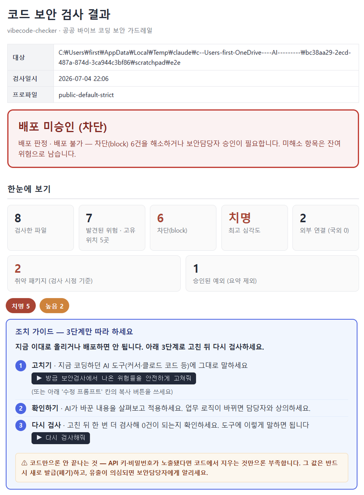

<div align="center">

<!-- 로고: docs/assets/logo.png 를 추가하면 아래 줄의 주석을 해제하세요 -->
<!--  -->

# 🛡️ vibecode-checker

### AI로 빠르게 만든 코드, 한국 정부 보안 기준으로 점검하세요.

바이브 코딩(AI 코딩 도구로 빠르게 개발)한 결과물에 숨은 **개인정보 노출·API 키·SQL 삽입·위험한 명령 실행·취약 패키지**를, 공무원이 이해할 수 있는 **한국어 리포트**로 알려주는 보안 점검 도구입니다.


</div>

---

## 🎬 데모

> 💡 `gvskb scan ./내프로젝트` 한 줄이면, 무엇이 위험하고 어떻게 고치는지 한국어로 알려줍니다.

**HTML 보고서 예시** (`-o`로 저장 시 자동 생성 · 인쇄하면 PDF 결재 문서):

<p align="center">
  
</p>

<!-- 터미널 데모 GIF를 추가하려면 docs/assets/demo.gif 녹화 후 아래 주석을 해제하세요 -->
<!--  -->

아래는 텍스트(Markdown) 출력 예시입니다:

```text
$ gvskb scan ./my-project

## 결론
> 차단 권고 — 치명 등급 포함 총 6건 발견, 이 중 차단(block) 4건.
  커밋·배포 전 수정 또는 보안담당자 승인 필요.

#### [CRITICAL] 치명 · block — 주민등록번호 평문 저장 (app.py line 12)
  왜 위험한가: 주민번호는 일방향 해시·토큰화·마스킹 후 저장해야 합니다 …
  공공 업무 영향: 개인정보 유출, 정보주체 통지·과징금 …
  안전한 수정 방향: ↓
      # 수집 자체를 재검토하거나, KMS로 암호화 후 별도 PII 테이블에 …
  출처: KISA Python 가이드 제3절, 개인정보보호법 §29
```

---

## 📑 목차

- [60초 시작 가이드](#-60초-시작-가이드)
- [누구에게 필요한가](#-누구에게-필요한가)
- [무엇을 잡아주나요](#-무엇을-잡아주나요)
- [사용 가이드 (초보 → 고급)](#-사용-가이드)
- [무엇을 탐지하나 — 룰과 출처](#️-무엇을-탐지하나--룰과-출처)
- [성능 (정직하게)](#-성능-정직하게)
- [공공기관 · 망분리 환경](#️-공공기관--망분리-환경)
- [기여하기](#-기여하기)
- [연락 · 문의](#-연락--문의)
- [면책 · 라이선스](#️-면책--라이선스)

---

## 🚀 60초 시작 가이드

### 전제 조건 (Prerequisites)

- **Python 3.11 이상** (`python --version`으로 확인)
- 운영체제 무관 (Windows·macOS·Linux). Windows 한글 깨짐은 [한 번만 설정](docs/windows_utf8.md)

### 설치 (Installation)

먼저 패키지를 설치합니다. **CLI든 AI 코딩 도구(MCP)든 이 설치 하나면 둘 다 됩니다** — `gvskb` 명령과 MCP 서버(`python -m gvskb.server`)가 함께 설치됩니다.

> ℹ️ 현재 **PyPI에는 배포하지 않습니다**(공공기관·망분리 환경의 공급망 보안 고려). **GitHub 소스에서 설치**합니다.

```bash
# 가장 간단 — 한 줄 설치 (Python 3.11+)
pip install git+https://github.com/Lex6won/vibecode-checker.git

# 또는 소스를 받아 설치 (수정·기여하려면 -e 권장)
git clone https://github.com/Lex6won/vibecode-checker.git
cd vibecode-checker && pip install -e .
```

설치를 확인합니다:

```bash
gvskb doctor      # 룰 수·인코딩·MCP 상태 점검
```

> 망분리(인터넷 없는) PC라면, 외부망에서 위 소스를 받아(또는 `pip download`로 의존성까지) 옮긴 뒤 오프라인 설치하세요.

#### AI 코딩 도구에 MCP 연결 (선택)

Claude Desktop·Cursor·VS Code 등에서 **자연어로** 쓰려면, MCP 설정 파일에 아래를 추가합니다(위 `pip install` 이후):

```json
{
  "mcpServers": {
    "vibecode-checker": {
      "command": "python",
      "args": ["-m", "gvskb.server"],
      "env": { "PYTHONUTF8": "1", "PYTHONIOENCODING": "utf-8" }
    }
  }
}
```

설정 파일 위치(도구별):

| 도구 | 설정 파일 |
|---|---|
| **Claude Desktop** | Windows `%APPDATA%\Claude\claude_desktop_config.json` · macOS `~/Library/Application Support/Claude/claude_desktop_config.json` |
| **Cursor** | 설정 → MCP, 또는 프로젝트 루트 `.cursor/mcp.json` |
| **VS Code** (MCP 지원 확장) | 워크스페이스 `.vscode/mcp.json` 또는 사용자 `settings.json` 의 MCP 항목 |
| **Claude Code (CLI)** | 프로젝트 루트 `.mcp.json` (이 저장소의 [`.mcp.json`](.mcp.json) 참고) |

저장 후 도구를 재시작하면 연결됩니다. 확인: AI에게 *"server_status로 룰이 몇 개 로드됐는지 확인해줘"*.
(`python` 이 PATH에 없으면 전체 경로로 바꾸세요. Windows 한글 깨짐은 [한 번만 설정](docs/windows_utf8.md).)

> ⚠️ **신뢰하는 환경에서만 연결하세요** — MCP는 지정한 경로의 로컬 파일을 읽습니다([SECURITY.md](SECURITY.md)).

### 사용 (Usage)

쓰는 방식은 두 가지입니다. **터미널이 익숙하면 A**, **AI 코딩 도구를 쓰면 B** — 둘 중 편한 쪽으로.

#### A. 명령어(CLI)로 — 터미널에서

```bash
gvskb doctor                                  # 1) 내 환경 점검(룰 수·인코딩·MCP)
gvskb scan ./my-project                        # 2) 내 폴더 검사 → 화면에 한국어 리포트
gvskb scan ./my-project -o 보안점검.md          # 3) 파일 저장(.md + 색깔 카드형 .html 함께)

# 4) GitHub 레포는 받아서 검사 (URL → 폴더로 받은 뒤 동일하게 점검)
git clone --depth 1 https://github.com/owner/repo /tmp/repo && gvskb scan /tmp/repo -o 보안점검.md
```

`-o`로 저장하면 텍스트 `보안점검.md`와 인쇄→PDF 결재용 `보안점검.html`이 함께 만들어집니다.

#### B. AI 코딩 도구에서 — 그냥 말로 (VS Code·Claude Desktop·Cursor)

[MCP를 한 번 연결](#-더-써보기--mcp의존성오프라인)한 뒤, 코드를 짠 자리에서 **자연어로** 요청하면 됩니다. 명령어를 외울 필요가 없습니다:

- 🟢 *"이 폴더 **보안 검사 해줘** → ./my-project"*
- 🟢 *"이 코드가 **안전한지 확인해줘**"*  (코드를 붙여넣고)
- 🟢 *"**보안 체크 리포트 써줘**"* / *"**HTML 보고서로** 만들어줘"*
- 🟢 *"이 깃허브 레포 **보안 점검**해줘 → https://github.com/owner/repo"*
- 🟢 *"고쳤어, **다시 검사**해줘"*

트리거 단어: **보안 · 점검 · 체크 · 검토 · 검사 · 스캔 · "안전한지"**. Claude·Cursor에서는 `/보안점검` 명령으로도 한 번에 실행됩니다.

> ℹ️ **로컬 폴더·붙여넣은 코드**는 세 도구 모두 동작합니다. **GitHub URL을 직접 주는 것**은 셸을 쓰는 도구(**Claude Code·Cursor**)에서 됩니다 — AI가 먼저 `git clone` 후 검사합니다. **Claude Desktop**처럼 셸이 없으면 폴더를 가리키거나 코드를 붙여넣으세요(또는 먼저 clone).

> 📖 비전공자용 한 장 요약: [30초 시작 가이드](docs/quickstart_ko.md)

---

## 👋 누구에게 필요한가

- **"AI가 짜준 코드가 안전한지 모르겠어요"** — Claude Code·Cursor·Copilot으로 업무 코드를 만드는 분
- **민원·통계·DB·파일 업로드·챗봇**을 빠르게 만들어 보는 공공기관 실무자
- **위탁 개발 소스를 배포 전에 한 번 더 점검**하고 싶은 담당자
- **보안 용어는 어렵지만** "이게 위험한지, 어떻게 고치는지" 알고 싶은 분

---

## 🔍 무엇을 잡아주나요

| 흔한 실수 | 예시 |
|---|---|
| 🔑 코드에 박힌 비밀값 | `DB_PASSWORD = "admin1234"`, API 키, JWT 토큰 |
| 🆔 개인정보 노출 | 주민등록번호·전화번호 평문 저장 |
| 💉 SQL 삽입 | `"SELECT … WHERE name='" + name + "'"` |
| ⚡ 위험한 코드 실행 | `eval()`, `exec()`, `os.system(사용자입력)` |
| 🌐 웹 취약점 | XSS, 경로 조작, Flask `debug=True` 배포 |
| 📦 취약·가짜 패키지 | 알려진 CVE, 오타 노린 typosquat(`reqeusts`) |
| 🤖 AI 특화 위험 | 프롬프트에 개인정보 전송, LLM 출력 무검증 실행 |

---

## 📖 사용 가이드

### 🌱 처음이신가요 — 검사하고 리포트 읽기

```bash
gvskb scan ./my-project                              # 화면 출력
gvskb scan ./my-project --format markdown -o 보고서.md # 파일 저장
```

리포트의 **결과 색깔**만 알면 됩니다:

| 표시 | 뜻 | 무엇을 하나요 |
|---|---|---|
| 🔴 `block` | 그대로 배포하면 위험 | 먼저 고치거나 보안 담당자 검토 |
| 🟡 `warn` | 확인이 필요 | 코드 맥락 보고 판단 |
| 🟢 `allow` | 현재 기준 허용 | 참고만 |

> ⚠️ **검사된 파일이 0개**라고 나오면 "안전"이 아니라 *경로·확장자를 확인*하라는 뜻입니다.

### 🌿 더 써보기 — MCP·의존성·오프라인

<details>
<summary><b>GitHub 레포를 통째로 검사하기</b></summary>

이 도구는 **로컬 코드**를 검사합니다. 레포는 먼저 받은 뒤 그 폴더를 가리키면 됩니다
(코드를 외부로 보내지 않고, 받은 코드를 실행하지도 않습니다 — 정적으로 읽기만).

```bash
git clone --depth 1 https://github.com/owner/repo /tmp/repo
gvskb scan /tmp/repo -o 보안점검.md          # .md + .html 생성
# git 없이: curl -L .../archive/refs/heads/main.tar.gz | tar xz && gvskb scan repo-main
```

- 💬 **AI 도구에 연결했다면** URL만 줘도 됩니다: *"이 깃허브 레포 보안 점검해줘 → URL"* → AI가 먼저 `git clone` 후 검사합니다.
- 🤖 **CI 자동화**: PR·푸시마다 검사하려면 [GitHub Actions 예시](#-ci에-넣고-싶다면--자동-게이트)를 쓰세요(`checkout` → `gvskb scan`).
- ⚠️ **망분리 환경**에서는 clone이 안 되므로, 외부망에서 받은 폴더/zip을 반입해 로컬 경로로 검사하세요(`GVSKB_MODE=offline` 은 원격 URL을 받지 않음).

> 정리하면 — **폴더를 가리키거나 GitHub URL을 주고 "보안 점검"** 하면 됩니다. URL은 "받아서 폴더 검사"로 이어질 뿐 본질은 같습니다.
</details>

<details>
<summary><b>AI 코딩 도구(Claude Code·Cursor)에 연결하기</b></summary>

`claude_desktop_config.json` 등에 추가하면, AI에게 자연어로 "이 코드 안전한지 검사해줘"라고 물을 수 있습니다.

```json
{
  "mcpServers": {
    "vibecode-checker": {
      "command": "python",
      "args": ["-m", "gvskb.server"],
      "env": { "PYTHONUTF8": "1", "PYTHONIOENCODING": "utf-8" }
    }
  }
}
```
연결 후: *"server_status로 룰이 몇 개 로드됐는지 확인해줘"*

**이렇게 말하면 됩니다** (도구 이름을 몰라도, 아래 단어가 들어가면 점검→보고서까지 진행됩니다):

- 🟢 *"이 폴더 **보안 점검**해줘 → ./my-project"*
- 🟢 *"방금 만든 이 코드 **안전한지 체크**해줘"*
- 🟢 *"이 파일 **검토**하고 위험한 부분을 한국어 보고서로 만들어줘"*
- 🟢 *"고쳤어, **다시 검사**해줘"*

트리거 단어: **보안 · 점검 · 체크 · 검토 · 검사 · 스캔 · "안전한지"**. Claude·Cursor에서는 `/보안점검` 명령으로도 한 번에 실행됩니다. 잘 안 불러오면 *"vibecode-checker로 점검해줘"* 라고 덧붙이세요.

> ⚠️ **신뢰하는 클라이언트에만 연결하세요.** MCP `scan_path` 도구는 지정한 경로의 **로컬 파일을 읽습니다**(검사 목적). 연결한 AI 클라이언트가 임의 경로를 스캔하도록 요청할 수 있으므로, 신뢰할 수 있는 클라이언트·환경에서만 사용하고 민감 디렉터리는 가리키지 마세요. 자세한 내용은 [SECURITY.md](SECURITY.md) 참고.
</details>

<details>
<summary><b>설치하려는 패키지가 안전한지 확인하기</b></summary>

```bash
gvskb check-package requests --ecosystem pypi    # 알려진 취약점 조회
gvskb check-package reqeusts --ecosystem pypi    # 오타 패키지(typosquat) 경고
```
</details>

<details>
<summary><b>인터넷 없는 망분리 환경에서 쓰기</b></summary>

```bash
# (외부망 PC) 보안 피드 캐시를 미리 받아둡니다
gvskb update-intel --all

# (망분리 PC) 캐시를 옮긴 뒤, 외부 호출 없이 로컬 룰·캐시로만 검사
$env:GVSKB_MODE = "offline"      # PowerShell
gvskb doctor --offline
gvskb scan ./my-project
```
정적 분석 룰 95개는 **외부 통신 없이 그대로 동작**합니다.
</details>

### 🌳 CI에 넣고 싶다면 — 자동 게이트

`gvskb scan`은 결과에 따라 **종료 코드(exit code)**를 반환해 커밋·배포를 자동 차단할 수 있습니다.

| 종료 코드 | 의미 |
|---|---|
| `0` | 통과 |
| `1` | 경고(warn) 발견 |
| `2` | 차단(block) 발견 |
| `66` | 경로를 찾을 수 없음 |

```bash
gvskb scan ./src --fail-on block   # block만 실패시킴(2), warn은 통과 — CI 게이트 권장
gvskb scan ./src --fail-on warn    # warn 이상 실패 (기본값)
gvskb scan ./src --fail-on never   # 항상 0 (리포트만)
```

<details>
<summary><b>GitHub Actions 예시</b></summary>

```yaml
name: security scan
on: [push, pull_request]
jobs:
  scan:
    runs-on: ubuntu-latest
    steps:
      - uses: actions/checkout@v4
      - uses: actions/setup-python@v5
        with: { python-version: "3.11" }
      - run: pip install git+https://github.com/Lex6won/vibecode-checker.git
      - run: gvskb scan . --format markdown -o report.md --fail-on block
      - if: always()
        uses: actions/upload-artifact@v4
        with: { name: security-report, path: report.md }
```
</details>

<details>
<summary><b>pre-commit 훅 예시</b></summary>

```yaml
# .pre-commit-config.yaml
repos:
  - repo: local
    hooks:
      - id: gvskb-scan
        name: vibecode-checker 보안 스캔
        entry: gvskb scan
        args: ["--format", "json", "--fail-on", "block"]
        language: system
        types: [text]
```
</details>

---

## 🛡️ 무엇을 탐지하나 — 룰과 출처

탐지는 **한국 정부·국제 보안 가이드를 직접 인용**합니다. 단순 패턴 매칭이 아니라, *왜 위험한지 → 행정 업무에 어떤 사고로 이어지는지 → 어떻게 고치는지*를 출처와 함께 제시합니다.

| 출처 | 반영 |
|---|---|
| **KISA 시큐어코딩 가이드 (2023 개정)** | Python 45항목 · JavaScript 34항목 |
| **행안부 SW 개발보안 가이드** | 49개 보안약점 |
| **국정원 AI 보안 가이드북 (2025)** | AI 위협·대책 45룰 |
| **OWASP** | LLM Top 10 · Agentic Top 10 · AI Testing Guide |
| **실시간 취약점 피드** | OSV.dev · CISA KEV · NVD · FIRST EPSS |

> 총 **215개 룰** (자동 탐지 95 + 지식·참조 120). 모든 룰은 Markdown 한 장으로 정의돼 누구나 읽고 검토·확장할 수 있습니다.

---

## 📊 성능 (정직하게)

**독립 코퍼스**(외부 ground truth 30개 시드)로 측정한 카테고리별 탐지율:

```text
개인정보(PII)   ████████████████████  100%   (5/5)
시크릿·키       ████████████████████  100%   (4/4)
코드 실행       ████████████████████  100%   (3/3)
암호화·TLS      ████████████████████  100%   (3/3)
Python 전체     █████████████████░░░   85%
SQL·명령 주입   ████████████████░░░░   80%
JavaScript      ███████████████░░░░░   75%
─────────────────────────────────────────────
종합 recall     ███████████████████░   96.7%  · 오탐 0
```

| 측정 | 값 | 방식 |
|---|---|---|
| **독립 코퍼스 탐지율** | **recall 96.7%** · 오탐 0 | `eval_corpus/` 30 시드, 결정론 |
| 자체검증 매크로 P/R/F1 | 100% | 룰 내장 예제 — *의도-구현 일치* 측정 |
| 테스트 | 326개 통과 | 유닛·통합·룰 메타 |

재현: `GVSKB_MODE=offline PYTHONPATH=src python scripts/run_benchmark.py`

> **정직성 원칙**: "자체검증 100%"는 룰이 자기 예제를 맞히는 측정이라 외부 코드 성능을 뜻하지 않습니다. 그래서 *독립 코퍼스*로 따로 측정해 **96.7%**를 함께 공개합니다. **보안 전문 검토를 대체하지 않는 1차 보안 린터**로 설계되었습니다.

---

## 🏛️ 공공기관 · 망분리 환경

- **소스코드는 외부로 전송되지 않습니다.** 모든 정적 분석은 로컬에서 수행됩니다.
- 외부 통신은 *패키지 취약점 조회*에 한정(OSV·CISA·NVD·EPSS 5개 공개 API). 보내는 것은 패키지명·CVE ID 같은 공개 식별자뿐입니다.
- `GVSKB_MODE=offline` 한 줄로 외부 통신을 완전 차단하고, 사전에 받아둔 캐시·로컬 룰만으로 동작합니다.

---

## 🤝 기여하기

룰은 코드가 아니라 **Markdown 파일 한 장**입니다. `rules/` 아래에 frontmatter로 탐지 패턴·설명·예제를 적으면 끝입니다.

```bash
gvskb validate-rules     # 새 룰 형식·정규식 검증
gvskb evaluate           # 룰 예제 기반 정밀도 측정
pytest -q                # 전체 테스트
```

새 룰에는 `examples.positive`/`negative`를 넣어주세요 — 회귀 테스트로 자동 보증됩니다. 자세한 방법은 [CONTRIBUTING.md](CONTRIBUTING.md)를 참고하세요.

기여를 환영합니다:
- 🐛 **버그·오탐 제보** → [Issues](https://github.com/Lex6won/vibecode-checker/issues)
- 💡 **새 룰·기능 제안** → [Discussions](https://github.com/Lex6won/vibecode-checker/discussions)
- 🔧 **직접 고치기** → Pull Request (작은 PR 환영)

---

## 📮 연락 · 문의

- **버그·기능 요청**: [GitHub Issues](https://github.com/Lex6won/vibecode-checker/issues)
- **사용 질문·아이디어**: [GitHub Discussions](https://github.com/Lex6won/vibecode-checker/discussions)
- **보안 취약점 비공개 제보**: `SECURITY.md`의 절차를 따라주세요
- **그 외 문의**: 메인테이너에게 이슈로 멘션해 주세요

---

## ⚖️ 면책 · 라이선스

> 이 도구의 자동 점검은 **공식 보안적합성 검토를 대체하지 않습니다.** 비전공자가 명백한 실수를 1차로 걸러내고 학습하도록 돕는 보조 도구입니다. `critical`·`high` 항목은 보안 담당자 검토를 권장하며, 기관별 보안 정책·개인정보 처리 기준을 함께 확인하세요.

정부·공공기관 지침(KISA·행안부·국정원), OWASP·NIST·CISA 등 외부 자료는 원문을 복제하지 않고 요약·인용·구조화하여 사용하며 각 출처의 이용 조건을 존중합니다.

**MIT License** — 자유롭게 사용·수정·배포할 수 있습니다. [LICENSE](LICENSE) 참고.

---

<div align="center">
<sub>공공기관 바이브 코딩의 첫 번째 보안 게이트 · Made for public-sector developers in Korea</sub>
</div>
